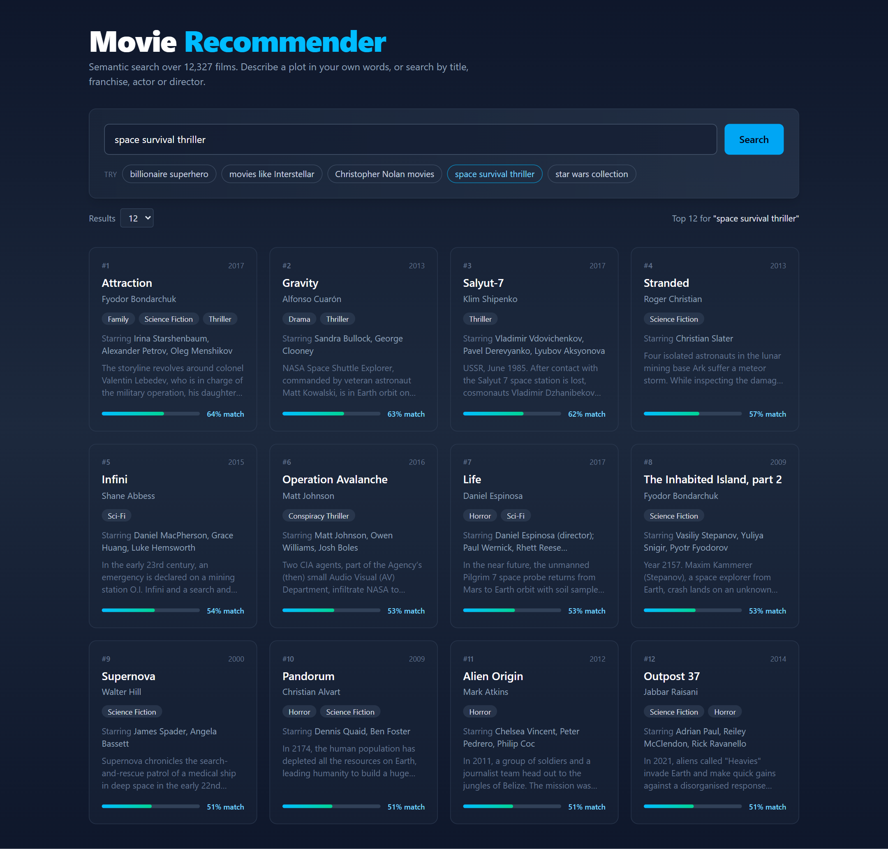

# Movie Recommendation System

A semantic movie recommender that understands what you *describe*, not just what you
type. Ask for `space survival thriller` or `billionaire superhero` and it returns
ranked films — no exact title required.

Built as my project for the **IEEE Young Protégé 2025** mentoring program
(AI/ML/LLM domain), mentored by **Mr. Arshardh Ifthikar**, Technical Lead at WSO2.



## What makes it semantic

A keyword recommender matches the words you typed. This one matches *meaning*: every
movie is embedded into a 768-dimensional vector built from its title, plot, keywords,
genre, director and cast, and your query is embedded into the same space. Ranking is
cosine similarity between the two.

That is why `space survival thriller` returns *Gravity*, *Salyut-7*, *Stranded* and
*Infini* — none of which share a single word with the query.

The first version used TF-IDF and cosine similarity. It worked, but natural-language
queries returned weak results — TF-IDF can only match words that literally overlap.
Switching to `all-mpnet-base-v2` sentence embeddings is what made descriptive search
actually work, and it is the single biggest change in the project.

## Query types

The backend detects intent before searching, so one search box handles five different
kinds of request:

| Example query | What happens | Actual top results |
|---|---|---|
| `space survival thriller` | Semantic search, with a boost for the detected genre | Attraction, Gravity, Salyut-7 |
| `movies like Interstellar` | Resolves the title, then finds its nearest neighbours in embedding space | Gravity, Mission to Mars, Red Planet |
| `Christopher Nolan movies` | Narrows to that person's filmography, then ranks it semantically | The Dark Knight Rises, The Dark Knight, Batman Begins |
| `billionaire superhero` | Pure semantic search over plot and keyword embeddings | Daredevil, Watchmen, Super |
| `star wars collection` | Franchise detection — returns matching titles in release order | Attack of the Clones, Revenge of the Sith |

Titles are matched with RapidFuzz, so `intersteller` and `Interstellar` land on the
same film. The matcher requires the matched title to be a comparable length to the
query, because otherwise a short title scores highly as a substring of a long one —
"christopher nolan movies" matches the film *Her*, and "space survival thriller"
matches *Urvi*.

## How it works

```
                 ┌──────────────────────────┐
   User query    │  React + Vite + Tailwind │
   ───────────>  │  search box, result grid │
                 └────────────┬─────────────┘
                              │  POST /recommend  { query, top_n }
                              v
                 ┌──────────────────────────┐
                 │      Flask REST API      │
                 └────────────┬─────────────┘
                              │
                              v
                 ┌──────────────────────────┐
                 │  SemanticMovieRecommender│
                 │  1. detect query intent  │
                 │  2. encode query         │
                 │  3. cosine similarity    │
                 │  4. re-rank with boosts  │
                 └────────────┬─────────────┘
                              │
                              v
                 ┌──────────────────────────┐
                 │ Cached corpus embeddings │
                 │ 12,327 x 768 float32     │
                 └──────────────────────────┘
```

Encoding the whole corpus takes minutes, so the embedding matrix is written to disk on
first run and keyed by a hash of the model name and the corpus text. Later starts load
it in about a second, and the cache invalidates itself automatically if the dataset or
model changes.

## Tech stack

| Layer | Tools |
|---|---|
| Embeddings | `sentence-transformers` (`all-mpnet-base-v2`), PyTorch |
| Ranking | Cosine similarity, RapidFuzz title matching, intent-based re-ranking |
| Data | pandas, NumPy |
| API | Flask, Flask-CORS |
| UI | React 19, Vite, TailwindCSS 4, axios |

## Dataset

[Wikipedia Movie Plots](https://www.kaggle.com/datasets/jrobischon/wikipedia-movie-plots)
from Kaggle, filtered to **films released between 2000 and 2017**. Preprocessing
normalises text, cleans the director and cast fields, and derives a `Keywords` column
from each plot — a step suggested by my mentor that measurably improved result quality.

The API applies a further clean-up pass at load time (`prepare()` in `app.py`), because
the source data has some rough edges: about 100 titles arrive doubled as
`"Avengers, TheThe Avengers"`, roughly 580 director fields carry a leftover
`"Director:"` label, and every film is listed once per origin, so titles repeat. That
leaves **12,327 unique films** to embed.

- Raw data: `data/raw/`
- Preprocessed data: `data/processed/Movies_Preprocessed.csv`
- Preprocessing, the TF-IDF baseline and the FAISS experiments: `Movie_Recommendation.ipynb`

## Getting started

**Requirements:** Python 3.10+ and Node 18+. A CUDA GPU is optional but makes the
first-run encoding roughly 10x faster.

### 1. Backend

```sh
git clone https://github.com/KesharaGunathilaka/Movie-Recommendation-System
cd Movie-Recommendation-System/backend
pip install -r requirements.txt
python app.py
```

The API starts on `http://localhost:8000`. Run it from inside `backend/`, since the
default dataset path is relative. The first start encodes all 12,327 movies and caches
the result to `backend/.embeddings_cache/`; later starts load from that cache.

### 2. Frontend

In a second terminal:

```sh
cd frontend
npm install
npm run dev
```

Open `http://localhost:5173`.

### Configuration

| Variable | Default | Purpose |
|---|---|---|
| `MOVIES_CSV` | `../data/processed/Movies_Preprocessed.csv` | Dataset path |
| `MODEL_NAME` | `all-mpnet-base-v2` | Any sentence-transformers model |
| `DEVICE` | auto-detected | Force `cuda` or `cpu` |
| `TOP_N` | `10` | Default number of results |
| `PORT` | `8000` | API port |
| `VITE_API_BASE` | `http://localhost:8000` | API URL used by the frontend |

On a low-memory machine, `MODEL_NAME=all-MiniLM-L6-v2` encodes several times faster in
exchange for slightly weaker results.

## API

### `POST /recommend`

```sh
curl -X POST http://localhost:8000/recommend \
  -H "Content-Type: application/json" \
  -d '{"query": "billionaire superhero", "top_n": 5}'
```

```json
{
  "query": "billionaire superhero",
  "results": [
    {
      "Title": "Daredevil",
      "Director": "Mark Steven Johnson",
      "Cast": "Ben Affleck, Jennifer Garner, Michael Clarke Duncan, Colin Farrell",
      "Genre": "superhero",
      "Year": 2003,
      "Plot": "Matt Murdock is a blind lawyer in New York City's Hell's Kitchen...",
      "Score": 0.4864687395095825
    }
  ]
}
```

`Score` is the cosine similarity, including any intent boost applied during re-ranking.
Plots are trimmed to roughly 1,200 characters, since a full plot runs to several
thousand and the UI only shows a snippet.

### `GET /health`

Returns API status, the active device, the model in use and the number of movies loaded.

## Project structure

```
├── backend/
│   ├── app.py              Flask API: /recommend and /health
│   ├── recommender.py      SemanticMovieRecommender: intent detection, ranking, caching
│   └── requirements.txt
├── frontend/
│   └── src/
│       ├── App.jsx
│       └── components/     SearchBar, ResultsGrid, MovieCard, MovieModal
├── data/
│   ├── raw/                Original Kaggle dataset
│   └── processed/          Cleaned dataset used by the API
└── Movie_Recommendation.ipynb   Preprocessing, TF-IDF baseline, experiments
```

## Future work

- Hybrid recommendations combining content-based and collaborative filtering
- User profiles so recommendations adapt to watch history and ratings
- An approximate-nearest-neighbour index (FAISS) to keep search fast as the corpus grows
- Poster and metadata enrichment through the TMDB API

## Acknowledgements

Built during **IEEE Young Protégé 2025**, powered by IEEE Young Professionals Sri Lanka
and IEEE StudPro 8.0, in collaboration with IEEE MGA SAC and IEEE ELEVATE.

Thanks to my mentor **Mr. Arshardh Ifthikar** (Technical Lead, WSO2), whose push toward
plot-derived features and a vector-based representation shaped the system this became.

---

**Keshara Gunathilaka** — Faculty of Engineering, University of Ruhuna
